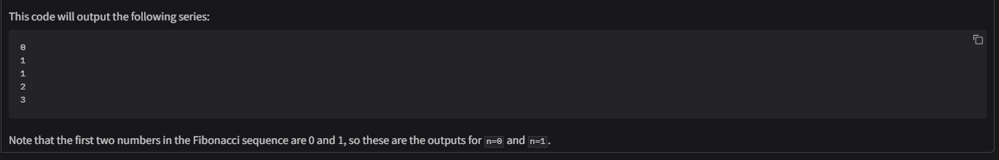

# 🤖 CodeWizard

**CodeWizard** is an intelligent assistant built with Python and Gradio. It connects to a local language model API and provides contextual answers to coding, AI, and project-related questions via a clean and interactive chat interface.

---

## ✨ Features

- Context-aware AI chat assistant
- Clean Gradio-based web UI
- Chat history during session
- Stylish gradient-styled name for visual appeal
- Dark-mode friendly design

---

📸 App Preview


---


---



---

## 🚀 Getting Started

### Prerequisites

Make sure you have the following installed:

- Python 3.7 or higher

Then install the required Python packages:

```bash
pip install requests gradio
```

---

## 🧠 Local Language Model API

This app assumes a local model API (such as [Ollama](https://ollama.com/)) running at:

```
http://localhost:11434/api/generate
```

If your API runs on a different address or port, modify the `url` variable in `app.py` accordingly.

---

## 🛠 How It Works

When you submit a prompt:

1. Your message is added to a chat history list.
2. A final prompt is generated by concatenating all previous user prompts.
3. The request is sent to the local model using the following JSON:

```json
{
  "model": "CodeWizard",
  "prompt": "<concatenated prompts>",
  "stream": false
}
```

4. The model returns a response, which is appended to the chat.

---

## 💻 Usage

1. Clone this repository:
```bash
git clone https://github.com/yourusername/codewizard.git
cd codewizard
```

2. Run the application:
```bash
python app.py
```

3. A Gradio interface will open in your browser. Start chatting!

---

## 🧹 Clearing the Chat

Click the **Clear Chat** button (`🧹`) in the UI to reset the conversation history.

---

## 📁 Project Structure

```
codewizard/
├── app.py        # Main script with API and UI
└── README.md     # Documentation
```

---

## 🎨 UI Overview

- Title: "🤖 CodeWizard" with gradient styling (in CSS inside the script)
- Description: "Ask anything about code, AI, or your project..."
- Chatbot panel with history
- Prompt input box
- Buttons: "🚀 Generate Response" and "🧹 Clear Chat"

---

## 🙌 Acknowledgements

- [Gradio](https://gradio.app/)
- [Ollama](https://ollama.com/)
- Inspired by the open-source AI and developer tools community

---

## 📬 Contact

Feel free to open an issue or fork the repository to contribute!
